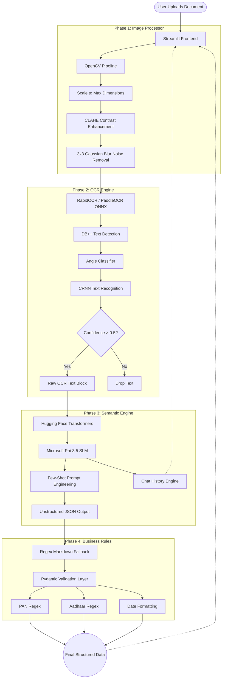

# System Architecture

The following diagram illustrates the end-to-end data flow of the Intelligent OCR System, from image ingestion to the final structured JSON and interactive Chatbot layer.

```mermaid
graph TD
    %% User Inputs
    User([User Uploads Document]) --> Streamlit[Streamlit Frontend]
    
    %% Phase 1: Preprocessing
    subgraph Phase 1: Image Processor
        Streamlit --> OpenCV[OpenCV Pipeline]
        OpenCV --> Normalize[Scale to Max Dimensions]
        Normalize --> Contrast[CLAHE Contrast Enhancement]
        Contrast --> Blur[3x3 Gaussian Blur Noise Removal]
    end

    %% Phase 2: Vision OCR
    subgraph Phase 2: OCR Engine
        Blur --> RapidOCR[RapidOCR / PaddleOCR ONNX]
        RapidOCR --> DB[DB++ Text Detection]
        DB --> Angle[Angle Classifier]
        Angle --> CRNN[CRNN Text Recognition]
        CRNN --> ConfidenceFilter{Confidence > 0.5?}
        ConfidenceFilter -- Yes --> RawText[Raw OCR Text Block]
        ConfidenceFilter -- No --> Drop[Drop Text]
    end

    %% Phase 3: Semantic LLM
    subgraph Phase 3: Semantic Engine
        RawText --> HF[Hugging Face Transformers]
        HF --> Phi3[Microsoft Phi-3.5 SLM]
        Phi3 --> FewShot[Few-Shot Prompt Engineering]
        FewShot --> JSONString[Unstructured JSON Output]
        Phi3 --> Chatbot[Chat History Engine]
    end

    %% Phase 4: Validation
    subgraph Phase 4: Business Rules
        JSONString --> RegexFallback[Regex Markdown Fallback]
        RegexFallback --> Pydantic[Pydantic Validation Layer]
        Pydantic --> PAN[PAN Regex]
        Pydantic --> Aadhaar[Aadhaar Regex]
        Pydantic --> Dates[Date Formatting]
    end

    %% Output
    PAN --> FinalOutput((Final Structured Data))
    Aadhaar --> FinalOutput
    Dates --> FinalOutput
    
    FinalOutput -.-> Streamlit
    Chatbot -.-> Streamlit
```
