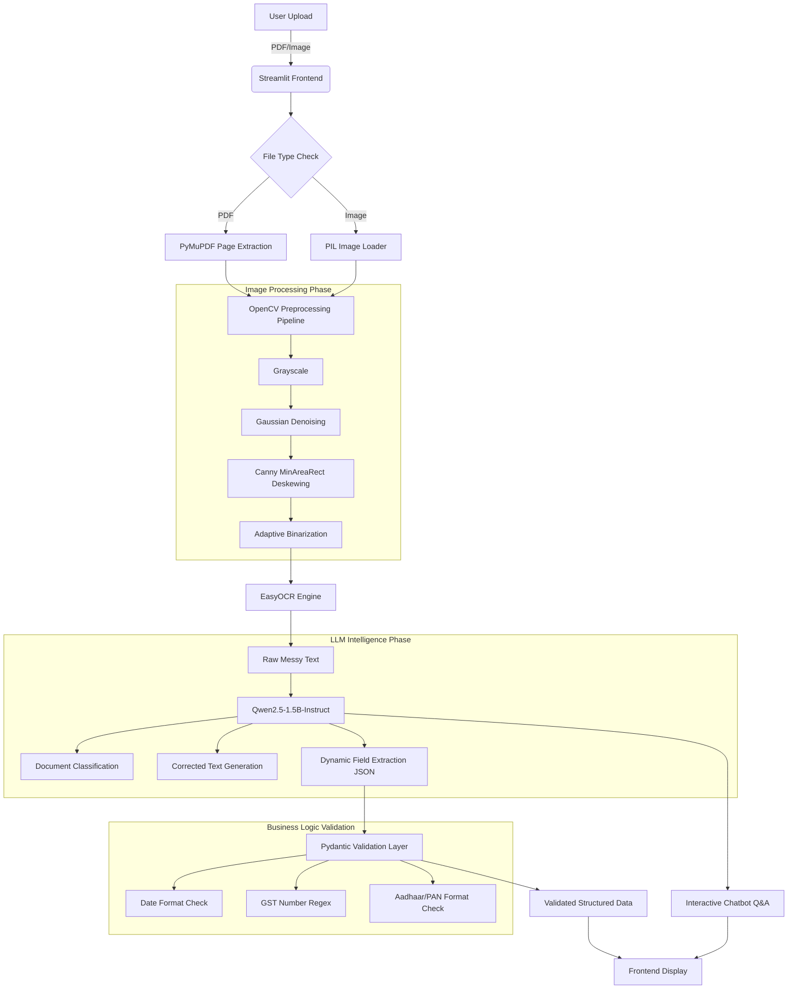

# Intelligent OCR System: Technical Report

## 1. Introduction
This report details the design and implementation of an end-to-end Intelligent Optical Character Recognition (OCR) System. The objective was to build a robust pipeline that not only extracts raw text from document images and PDFs but also intelligently structures, validates, and classifies the information using exclusively open-source tools (EasyOCR, Hugging Face LLMs, OpenCV).

## 2. System Architecture



## 3. Image Preprocessing & OCR Workflow
Raw documents captured by mobile cameras are inherently messy, suffering from poor lighting, noise, and rotation (skew). 

**The Preprocessing Pipeline (`src/image_processing.py`):**
1. **Grayscale Conversion:** Reduces computational overhead by discarding unnecessary color channels.
2. **Noise Removal:** A Gaussian Blur (`5x5` kernel) mitigates salt-and-pepper noise common in low-resolution scans.
3. **Deskewing:** Using OpenCV's `minAreaRect`, the system detects the primary angle of the text blocks and applies an affine transformation to geometrically rotate the document back to a 0-degree baseline. This is critical for preventing OCR failure on sideways documents like rotated PAN cards.
4. **Adaptive Thresholding:** Unlike global thresholding, adaptive thresholding dynamically calculates the binarization cutoff for localized regions, rescuing documents plagued by heavy shadows.

The pristine numpy array is then passed to **EasyOCR**, an open-source PyTorch-based engine that utilizes a CNN/RNN architecture to extract strings of raw text.

## 4. LLM Integration & Information Extraction
The raw text extracted by EasyOCR often contains spelling errors and lacks context (e.g., distinguishing a vendor name from a product name).

**The LLM Engine (`src/llm_engine.py`):**
To achieve "Intelligent Extraction" without proprietary APIs, we integrated the open-source `Qwen/Qwen2.5-1.5B-Instruct` model directly from Hugging Face via the `transformers` library.
* **Prompt Engineering:** The LLM is instructed via a strict system prompt to act as an information architect. It dynamically reads the context, classifies the document into predefined categories (e.g., 'Invoice', 'Aadhaar Card', 'Bank Statement'), corrects the raw OCR text, and structures the identified entities into a strict JSON dictionary.
* **Chatbot Interface:** By passing the OCR text into a secondary generation pipeline, the LLM also serves as a document Q&A agent, allowing users to interrogate the document interactively.

## 5. Validation Logic
Extracting data is only half the battle; ensuring data integrity is crucial for industrial pipelines. 

**The Validation Layer (`src/validation.py`):**
We utilize `Pydantic` to enforce strict schema types and business rules.
* **Regex Security Guards:** Custom validators are deployed for complex Indian formats. For example, GST Numbers are validated against `^\d{2}[A-Z]{5}\d{4}[A-Z]{1}[A-Z\d]{1}Z[A-Z\d]{1}$`, and Date fields are checked for valid generic formats (`DD/MM/YYYY`).
* **Type Coercion:** String amounts extracted by the LLM (e.g., "100.50") are strictly cast to floats, preventing downstream database errors.

## 6. Challenges Faced & Solutions
1. **Rotated Inputs:** Initially, sideways ID cards (PAN cards) caused catastrophic OCR failure, leading the LLM to hallucinate dummy data (e.g., "John Doe") to fulfill the JSON schema constraint. **Solution:** Implemented the MinAreaRect deskewing pipeline in OpenCV and injected strict anti-hallucination commands into the LLM system prompt.
2. **Local LLM Latency:** Running a 1.5B parameter Transformer model on a local CPU incurs significant latency (2-5 minutes per document). **Solution:** Implemented asynchronous Streamlit UI state handling (`st.session_state`) so the user can interact with the Chatbot without triggering a full re-run of the massive extraction pipeline. Added clear UX warnings regarding CPU wait times.
3. **Regex Extraction over LLM Generation:** Open-source LLMs occasionally wrap their JSON output in Markdown blocks (`````json ... `````). **Solution:** Built a robust regex parsing layer (`re.search(r'\{.*\}')`) to strip conversational artifacts and safely parse only the pure JSON payload.
